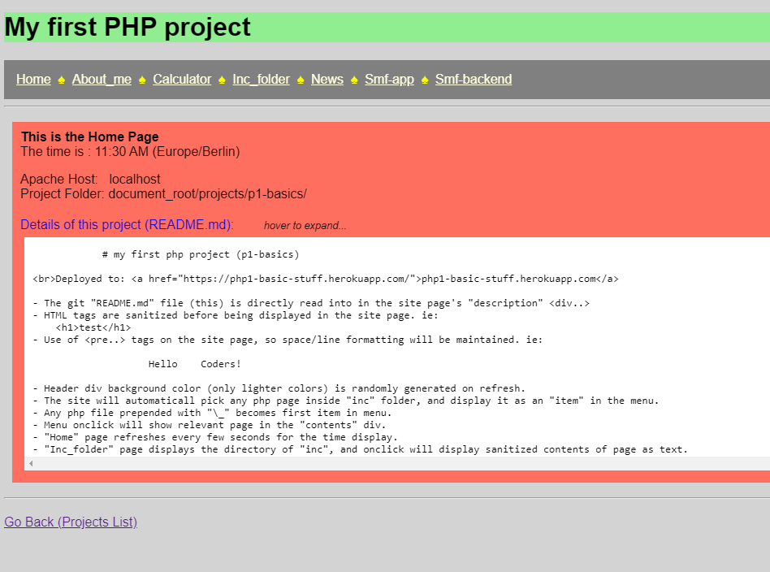

# My first PHP project (p1-basics)

- The git "README.md" file (this) is directly read into in the site page's "description" <div..>
- HTML tags are sanitized before being displayed in the site page. ie:
    <h1>test</h1>
- Use of <pre..> tags on the site page, so space/line formatting will be maintained. ie:

                    Hello    Coders!

- Header div background color (only lighter colors) is randomly generated on refresh.
- The site will automaticall pick any php page inside "inc" folder, and display it as an "item" in the menu.
- Any php file prepended with "\_" becomes first item in menu.
- Menu onclick will show relevant page in the "contents" div.
- "Home" page refreshes every few seconds for the time display.
- "Inc_folder" page displays the directory of "inc", and onclick will display sanitized contents of page as text.

<pre>
Developer:   Victor Wright
Client:      Self
Date:        21 May 2022
Deployed V1: <a href="https://php-p1.vercel.app">https://php-p1.vercel.app</a>
GH Page:     <a href="https://vrw-gh.github.io/php-p1/">vrw-gh.github.io/php-p1</a>
</pre>
